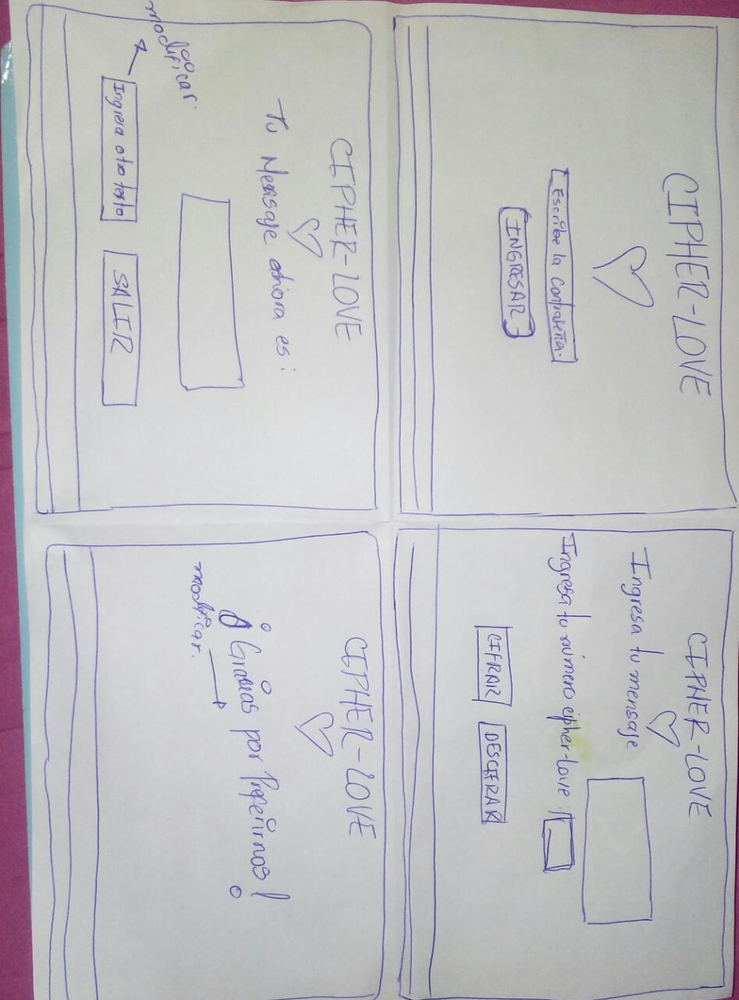

# CIPHER-LOVE
 Es una web que va dedicada a usuarios que desean resguardar la privacidad de sus  mensajes de amor, poder recibirlos y enviarlos en cualquier momento ,en presencia de otras personas, sin tener que exponer el contenido que seguramente les pueda parecer vergonzoso.
 Tiene como objetivo crear un lenguaje para que solo pueda ser entendido por las personas con las que se desee compartir el contenido. CIPHER-LOVE te va a pedir una clave para ingresar y luego tendrás que escribir tu mensaje e ingresar el número cipher-love que se va a ser la clave con la que se va a cifrar o descifrar según sea el caso y finalmente le das click a la opción deseada , con esa acción iras a un pantalla que te va a mostrar el resultado de tu mensaje y también tendrás la opción de volver a ingresar otro mensaje o salir . Comenzamos realizando nuestro primer prototipo en papel :
 
  Con la opinión de varios usuarios se modificaron los nombres de algunos botones porque indicaron que con los nombres asignados no se identificaban con la accion de deberia generar el boton , tambien se ajustaron detalles en  cuestiones de apariencia en general. Y asi  realizamos nuestra imagen de prototipo final en Balsamig.

